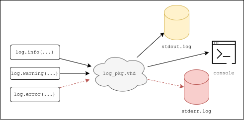

# Verification Library

This project will contain a few VHDL packages for verification purposes.

The log has the ability to redirect messages based on its level. For example, an error message will be written to a text file, `stderr.log`, for error-checking purposes. The user can modify the end destination, however.

